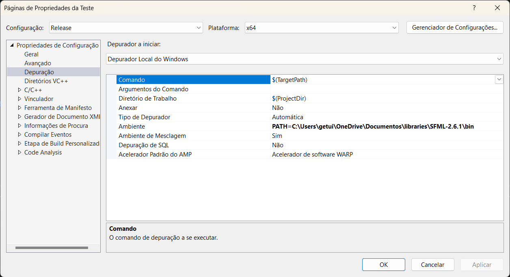
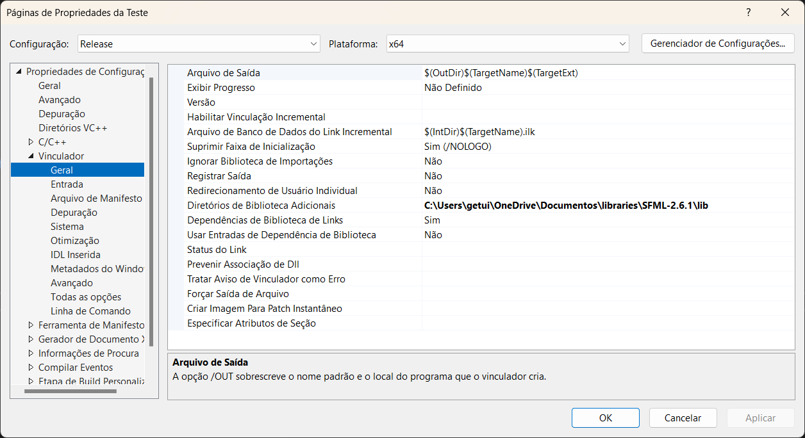
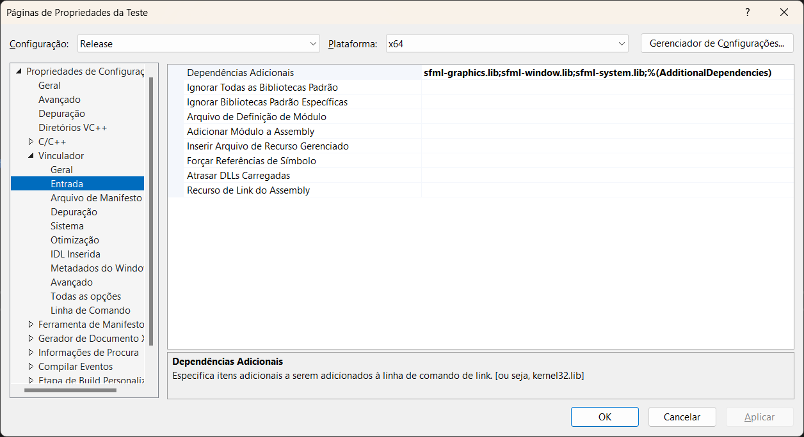
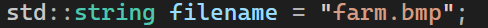
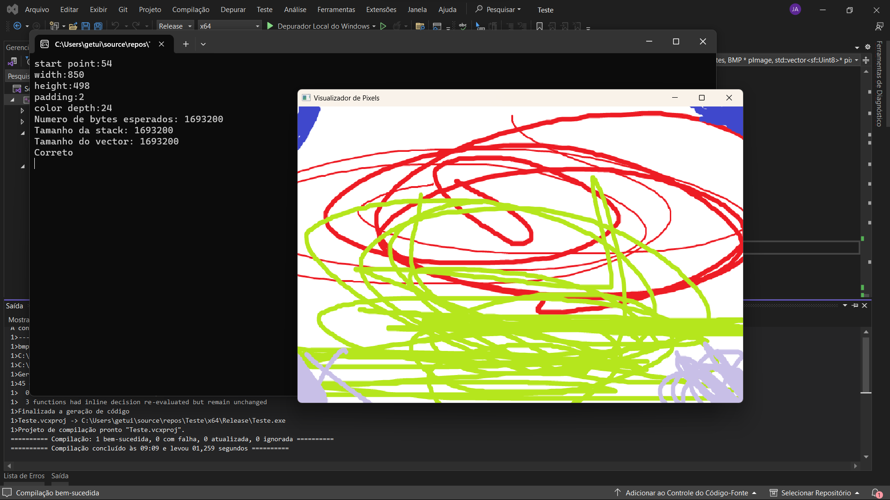
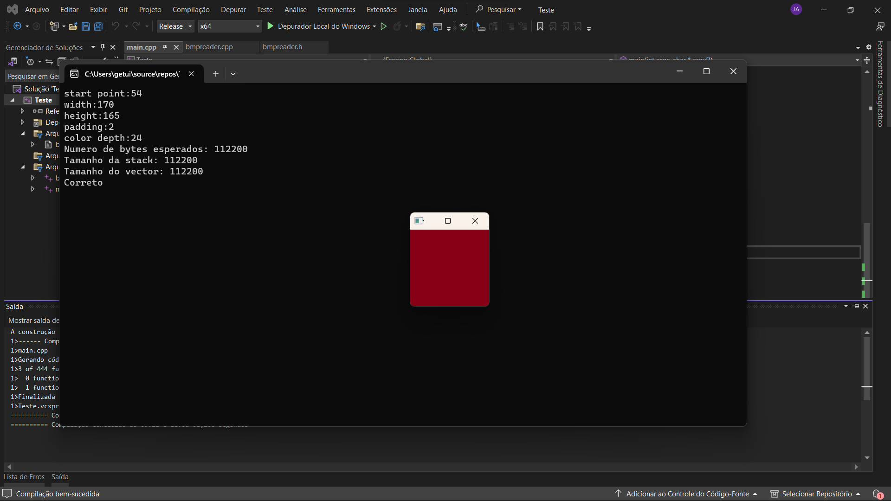

[](https://classroom.github.com/a/TuvsvrGo)

Biblioteca SFML: https://www.sfml-dev.org/download.php

Visual Studio: https://visualstudio.microsoft.com/pt-br/downloads/


# Instalação do SFML no Visual Studio

1. Colocar o diretorio da pasta de binarios do SFML em "ambiente"

2. Colocar o diretorio com as bibliotecas em "Diretorios de biblioteca adicionais" 

3. Colocar o nome das bibliotecas que serão usadas em "Dependencias Adicionais" (copy & past abaixo)


# Execução
1. No editor de código do Visual Studio basta trocar o nome do arquivo a ser aberto.



2. Executar com f5 ou clicando nas opções de build





# Problemas
1. Apenas as imagens feitas no paint conseguem ser exibidas corretamente, mas os motivos ainda não são claros
2. Algumas imagens que não foram feitas no paint conseguem ser exibidas pela metade, mas assim como as outros ficam com uma parte totalmente preta
3. Não tem menu grafico

### Copy and Past 
```
sfml-graphics.lib;sfml-window.lib;sfml-system.lib;
```
